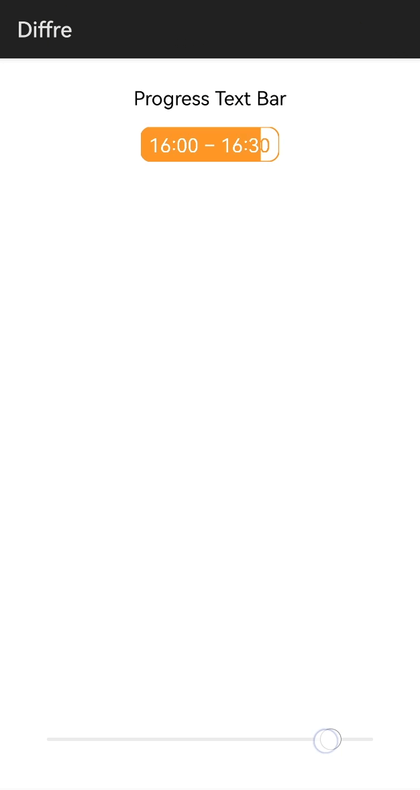

# Diffre
*pronounced - Differ*

Diffre is an application that shows how to change text color based on background. This can be used to create progress bars overlaid by text, custom animations involving complex shapes, and much more. It works on the simple principle of color difference: The colour of the text is subtracted from that of the background to maintain readability even as the background is changed dynamically. The code of this library is modular and easily extensible as per requirement.

# Source

Inspired by the Android library Diffre (v1.0, 14 Oct 2018) by Rakshak Hegde ([Email](mailto:rakshakhegde@gmail.com) | [Twitter](https://twitter.com/rakshakhegde)):

https://github.com/rakshakhegde/Diffre

## Features
* A progress bar overlaid on a text display which dynamically changes the colour of the text as the progress indicator changes.
* A complete and easily extensible implementation using `Region` API of HarmonyOS.



## Dependency
1. For using Diffre module in sample app, include the source code and add the below dependencies in entry/build.gradle to generate hap/support.har.
```
	dependencies {
		implementation project(':diffre')
        	testCompile 'junit:junit:4.12'
	}
```
2. For using Diffre module in separate application using har file, add the har file in the entry/libs folder and add the dependencies in entry/build.gradle file.
```
	dependencies {
		implementation fileTree(dir: 'libs', include: ['*.har'])
		testCompile 'junit:junit:4.12'
	}

```
## Usage

Refer to the [ability_main.xml](entry/src/main/resources/base/layout/ability_main.xml) file in the entry sample app.

Create a Progress Text Component in your layout file by adding the following XML tag:

```xml
<io.github.rakshakhegde.diffre.DiffreViewApi1
            ohos:id="$+id:fillShapeViewApi1"
            ohos:height="match_parent"
            ohos:width="match_parent"
            ohos:layout_alignment="center"
            ohos:top_margin="8vp"/>
```

To further customize this Component, refer to [DiffreView.java](diffre/src/main/java/io/github/rakshakhegde/diffre/DiffreView.java) where the following parameters may be customized:

* `PAINT_TEXT_SIZE`: Size of the display text in fp
* `PAINT_TEXT_PADDING`: Padding of the display text from the enclosing box in vp
* `PAINT_RADIUS`: Radius of the bounding rectangular box in vp
* `STROKE_WIDTH`: Thickness of the stroke used to display the text and bounding box in px
* `DISPLAY_COLOR`: Integer value of the Color used to display background and text. Use `Color.getIntColor(String)` to convert a String representation of color to the integer representation.

## Future Work
* As of SDK version 5, the `Path`-based implementation in the original library is not included. This means the given implementation is without the associated anti-aliasing feature. When a suitable provisions for the same are made available in future releases of the HarmonyOS API, this feature will be added.

License
-------
```txt
Copyright 2016 Rakshak Hegde

Licensed under the Apache License, Version 2.0 (the "License");
you may not use this file except in compliance with the License.
You may obtain a copy of the License at

    http://www.apache.org/licenses/LICENSE-2.0

Unless required by applicable law or agreed to in writing, software
distributed under the License is distributed on an "AS IS" BASIS,
WITHOUT WARRANTIES OR CONDITIONS OF ANY KIND, either express or implied.
See the License for the specific language governing permissions and
limitations under the License.
```
